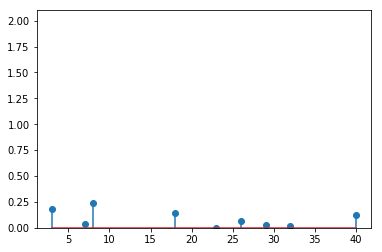
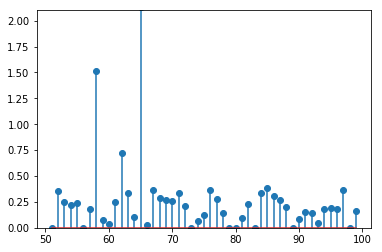

# Resumen de los resultados obtenidos

Hemos realizado el experimento con 6 sujetos, con las siguientes configuraciones:

* Sujeto 1 (mujer, 60 años): 50 repeticiones, 8 puntos (2 unidades de distancia), 2 segundos.

* Sujeto 2 (hombre, 60 años): 50 repeticiones, 8 puntos (2 unidades de distancia), 2 segundos.

* Sujeto 3 (mujer, 53 años): 80 repeticiones, 8 puntos (1 unidades de distancia), 1.2 segundos.

* Sujeto 4 (hombre, 55 años): 80 repeticiones, 8 puntos (2 unidades de distancia), 1.4 segundos.

* Sujeto 5 (mujer, 90 años): 30 repeticions, 4 puntos (1 unidad de distancia), 2 segundos.

* Sujeto 6 (hombre, 90 años): 20 repeticiones, 2 puntos (1 unidad de distancia), 2 segundos.

Las graficas que he obtenido muestran la diferencia que hay en cada iteracion entre el punto objetivo y el ultimo punto al que se ha llevado el cursor, es decir, el error que se comete. La escala de las graficas depende de la distancia entre los puntos: para los experimentos de 2 unidades de distancia sera sobre 2 (unidades), y para los de 1 unidades de distancia estara escalado sobre 1 (unidad). Es decir, el maximo error que se mostrara en las graficas sera 1 o 2, dependiendo del caso.

En algunos casos he incluido tambien las graficas de los tiempos, es decir, el tiempo que se tarda en cada intento. Las he incluido solo en los casos en el que tiene algo de sentido, porque en muchos casos el tiempo era constante (siempre era el maximo tiempo).

Los datos estan organizados en carpetas: cada sujeto tiene una carpeta con su nombre, y dentro de esa carpeta hay 4, una por cada fase del experimento (sin fuerza, con fuerza, sin fuerza y sin cursor, con fuerza y sin cursor). Dentro de cada carpeta de cada fase habra otras carpetas, cuyo nombre sera el angulo del punto objetivo (0, 45, 90, 135, 180, 225, 270 y 315 grados.) En la carpeta general de la fase estara la grafica con los errores totales de esa fase, y en cada subcarpeta la grafica con los errores de cada punto objetivo.

## Comparacion entre las fases de cada sujeto

### Sujeto 1

#### Sin fuerza

  
  
  
  

  
  
  
  

#### Con fuerza

  
  
  
  

  
  
  
  

#### Sin fuerza, sin cursor

  
  
  
  

  
  
  
  

#### Con fuerza, sin cursor

  
  
  
  

  
  
  
  

### Sujeto 2

#### Sin fuerza

  
  
  
  

  
  
  
  

#### Con fuerza

  
  
  
  

  
  
  
  

#### Sin fuerza, sin cursor

  
  
  
  

  
  
  
  

#### Con fuerza, sin cursor

  
  
  
  

  
  
  
  

### Sujeto 3

#### Sin fuerza

  
  
  
  

  
  
  
  

#### Con fuerza

  
  
  
  

  
  
  
  

#### Sin fuerza, sin cursor

  
  
  
  

  
  
  
  

#### Con fuerza, sin cursor

  
  
  
  

  
  
  
  

### Sujeto 4

#### Sin fuerza

  
  
  
  

  
  
  
  

#### Con fuerza

  
  
  
  

  
  
  
  

#### Sin fuerza, sin cursor

  
  
  
  

  
  
  
  

#### Con fuerza, sin cursor

  
  
  
  

  
  
  
  

### Sujeto 5

#### Sin fuerza

  
  
  
  

#### Con fuerza

  
  
  
  

#### Sin fuerza, sin cursor

  
  
  
  

#### Con fuerza, sin cursor

  
  
  
  

### Sujeto 6

#### Sin fuerza

  
  

#### Con fuerza

  
  

#### Sin fuerza, sin cursor

  
  

#### Con fuerza, sin cursor

  
  

## Comparacion de una misma fase entre varios sujetos

#### Sin fuerza

  
  
  

  
  
  

#### Con fuerza

  
  
  

  
  
  

#### Sin fuerza, sin cursor

  
  
  

  
  
  

#### Con fuerza, sin cursor

  
  
  

  
  
  

